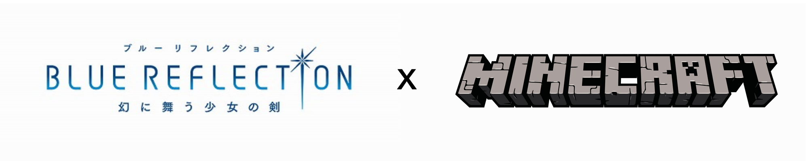

# Blue Reflection Minecraft Skins Pack

Welcome! This is an **Unofficial/Fanmade** project about the magical girls RPG videogame franchise **Blue Reflection**.

This project contains the skins of each character seen on the games and the anime T.V. show, which can be used as custom skins for the player in Minecraft PC (Java & Bedrock) and Mobile (Pocket) editions (unfortunately, not supported in console versions).

Giving some context, in the games (and anime) there are students and *Reflectors*, magical girls who fight with the power of feelings. Therefore, this pack contains student and *reflector* skins.

In each link below, is mentioned the pack structure and its content organized in the following folders. Each one has custom skins for students and *reflectors* in their **classic (4px) and slim (3px) body** type respectively, so you don't need to edit the skins images if you want to change the body type (these are in PNG format).

- [Blue Reflection](/src/BlueReflection.md)
- [Blue Reflection Ray](/src/BlueReflectionRay.md)
- [Blue Reflection Tie](/src/BlueReflectionTie.md)
- [Blue Reflection Sun](/src/BlueReflectionSun.md)
- [Uniforms](/src/Uniforms.md)
- [Costumes](/src/Costumes.md)
- [Accessories](/src/Accessories.md)

For further information about downloading and applying the skins to the player, read the [Online Manual](/MANUAL.md) or downlad one of the Offline User Manuals linked below, which contains the pack's last features.

- [Offline User Manual Light](/UserManualLight.pdf)
- [Offline User Manual Dark](/UserManualDark.pdf)

For terms of use of this project, read the [License](/LICENSE).

### Disclaimer

The Blue Reflection brand belongs to Koei Tecmo Holdings Co., Ltd. and Gust Co. Ltd., so I don't own any rights about the Blue Reflection franchise, including all the tangible and intangible products and goods.

All another rights reserved by their respective owners.
