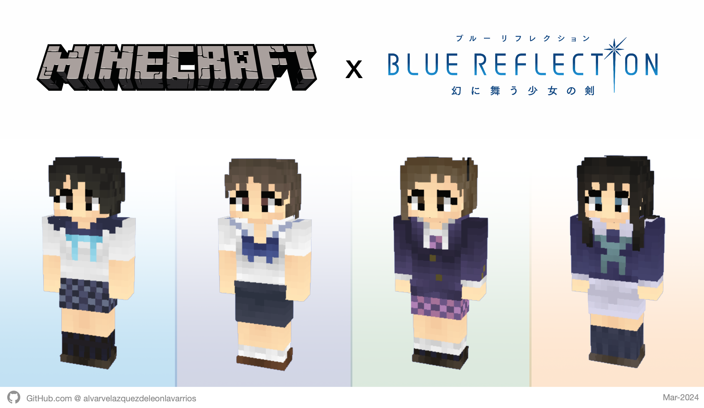

# Blue Reflection Minecraft Skins Pack

Welcome! This is an **Unofficial/Fan made** project about the magical girls RPG videogame franchise **Blue Reflection**.

The project contains skins of each character seen on the games and the anime TV show, which can be used as custom skins in Minecraft Java & Bedrock editions, according to the player’s body type: **Classic (Steve/4px)** and **Slim (Alex/3px) shapes**

## Skins Pack Content

The skins pack’s content is organized in the following folders:

- [Blue Reflection](/src/BlueReflection.md)
- [Blue Reflection Ray](/src/BlueReflectionRay.md)
- [Blue Reflection Tie](/src/BlueReflectionTie.md)
- [Blue Reflection Sun](/src/BlueReflectionSun.md)
- [Uniforms](/src/Uniforms.md)
- [Costumes](/src/Costumes.md)
- [Accessories](/src/Accessories.md)
- [Heads](/src/Heads.md)

Each one has its respective skin images in their **Classic (Steve/4px)** and **Slim (Alex/3px) body** types respectively, so the player doesn't need to edit the images.

## Manual

For further information about downloading and applying the skins to the player, read the [Online Manual](/MANUAL.md).

There are also two Offline Manual versions (light and dark) inside the zip file of each release.

## Disclaimer

The Blue Reflection brand belongs to Koei Tecmo Holdings Co., Ltd. and Gust Co. Ltd. All another rights reserved by their respective owners.

For terms of use of this project, read its [License](/LICENSE).
